# REVAMP1804

Giving Ubuntu 18.04 a Sierra-light-ish desktop look and feel.

## Motivation:

Beautifying the look and feel of a fresh install of Ubuntu 18.04 is definitely helpful. This revamping process can be time consuming. And to revamp multiple systems (or user accounts) becomes a nightmare. Also, using a fresh install of Ubuntu 18.04 does have it's quirks.

This program automates this revamping process to consistently give Ubuntu 18.04 a Sierra-light-ish desktop look and feel with less fresh install Ubuntu 18.04 quirks. 

## Program Overview:

This program does the following:

(a) Install certain 'deb' packages (and their ppa) into Ubuntu 18.04.
(b) Install and enable themes and extensions:
##### Themes :  [McHigh Sierra](https://www.gnome-look.org/p/1013714/  ), [Cupertino iCons Collection](https://www.gnome-look.org/p/1102582/) , [MacOS MOD](https://www.gnome-look.org/p/1241071/), [SanFranciscoFont](https://codeload.github.com/AppleDesignResources/SanFranciscoFont/zip/master), [macfonts](http://drive.noobslab.com/data/Mac/macfonts.zip), [revamp1804.css](resources/gnome-shell_theme/Revamp1804/revamp1804.css) 

##### Extensions:  [Always Zoom Workspaces](https://extensions.gnome.org/extension/503/always-zoom-workspaces/), [Arc Menu](https://extensions.gnome.org/extension/1228/arc-menu/), [Blyr](https://extensions.gnome.org/extension/1251/blyr/), [Dash to Dock](https://extensions.gnome.org/extension/307/dash-to-dock/), [Dynamic Panel Transparency](https://extensions.gnome.org/extension/1011/dynamic-panel-transparency/), [EasyScreenCast](https://extensions.gnome.org/extension/690/easyscreencast/), [Log Out Button](https://extensions.gnome.org/extension/1143/logout-button/), [NetSpeed](https://extensions.gnome.org/extension/104/netspeed/), [Removable Drive Menu](https://extensions.gnome.org/extension/7/removable-drive-menu/), [Screenshot Tool](https://extensions.gnome.org/extension/1112/screenshot-tool/), [Suspend Button](https://extensions.gnome.org/extension/826/suspend-button/), [User Themes](https://extensions.gnome.org/extension/19/user-themes/), [Workspace Indicator](https://extensions.gnome.org/extension/21/workspace-indicator/)

(c) Customize certain Gsettings values.

(d) Install a nautilus script to allow an easy change of the desktop and screensaver wallpapers.  

## Prerequisites

- An installed Ubuntu 18.04 system with Internet access.
- Administrator Privilege
- Python 3.6

## How to Use?

##### To revamp Ubuntu 18.04:

​    `$ python3.6 revamp1804.py --install`

##### To undo:

​     `$ python3.6 revamp1804.py --remove`

## Acknowledgements

- revamp1804.css is adapted from [High Ubunterra](https://www.gnome-look.org/p/1207015/ ), [McHigh Sierra](https://www.gnome-look.org/p/1013714/  ), and ubuntu.css. I sincerely thank the developers work for their beautiful work-of-art.
- I like to thank [PRATAP](https://askubuntu.com/users/739431/pratap), [pomsky](https://askubuntu.com/users/480481/pomsky), [vanadium](https://askubuntu.com/users/558158/vanadium), [jos](https://askubuntu.com/users/149708/jos), [rinzwind](https://askubuntu.com/users/15811/rinzwind), [dk-bose](https://askubuntu.com/users/248158/dk-bose) and [heynnema](https://askubuntu.com/users/4272/heynnema) for their answers and comments to my AskUbuntu questions. 

## The Revamp1804 Desktop

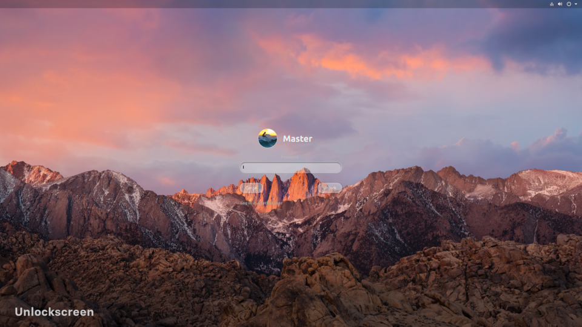

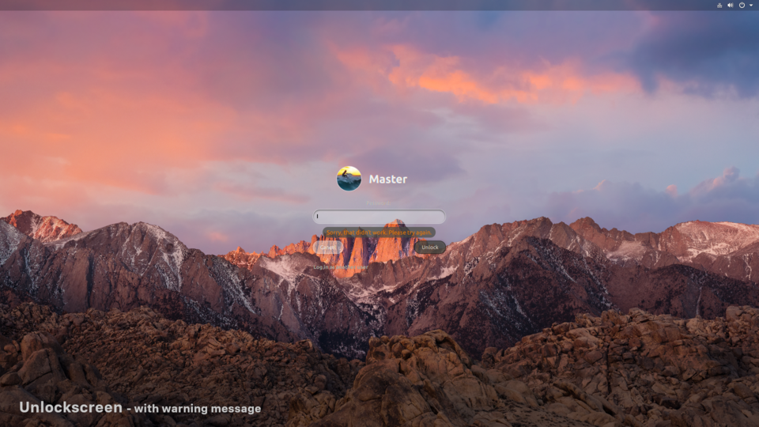

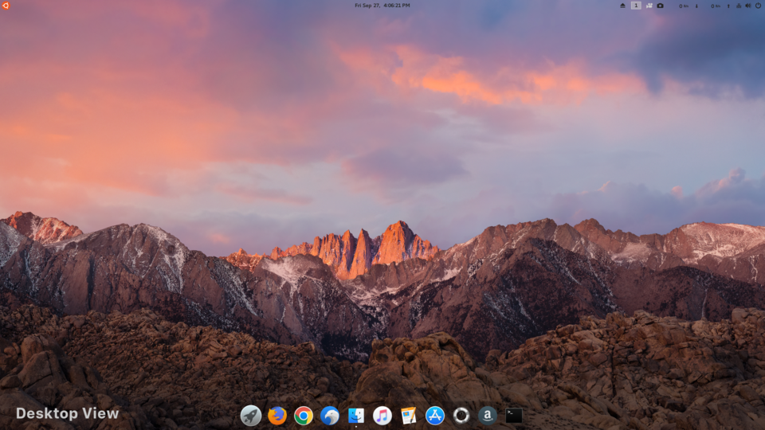

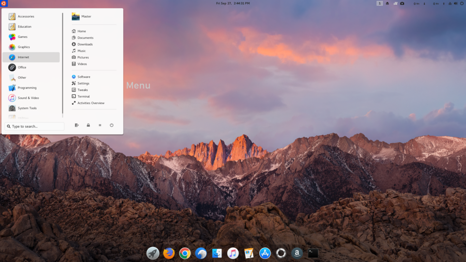

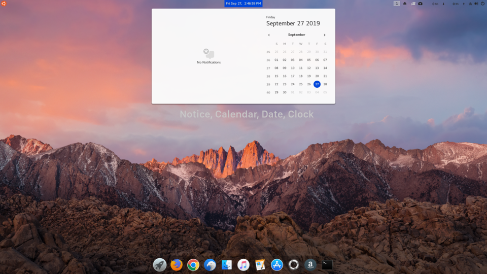

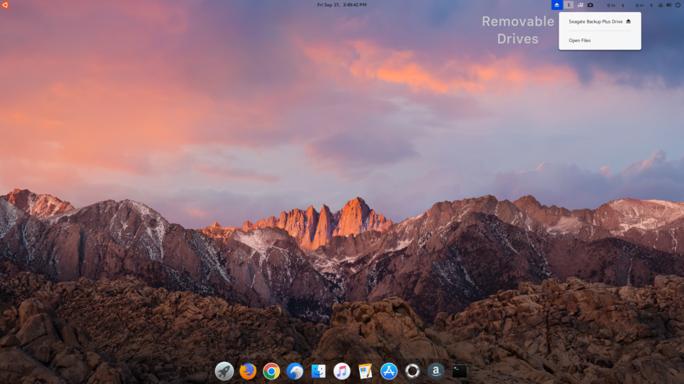

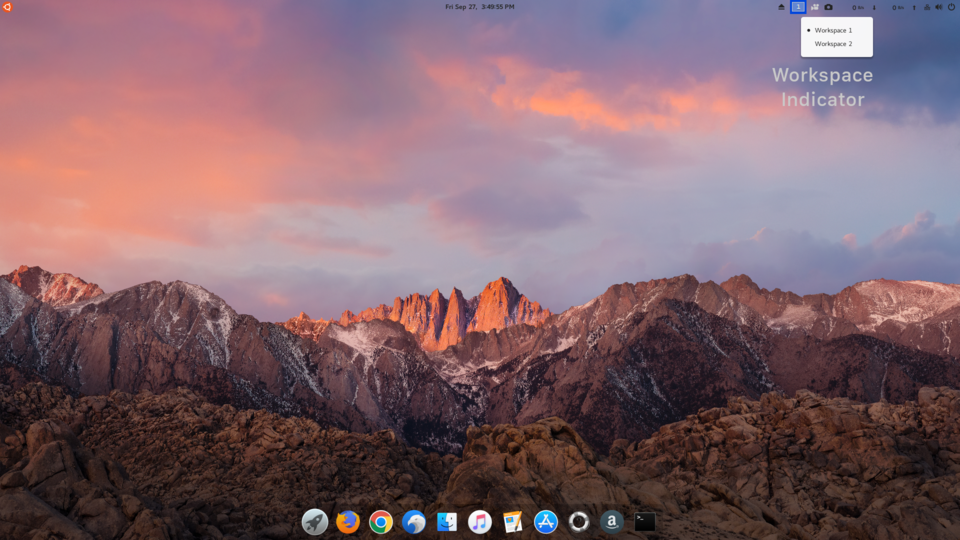

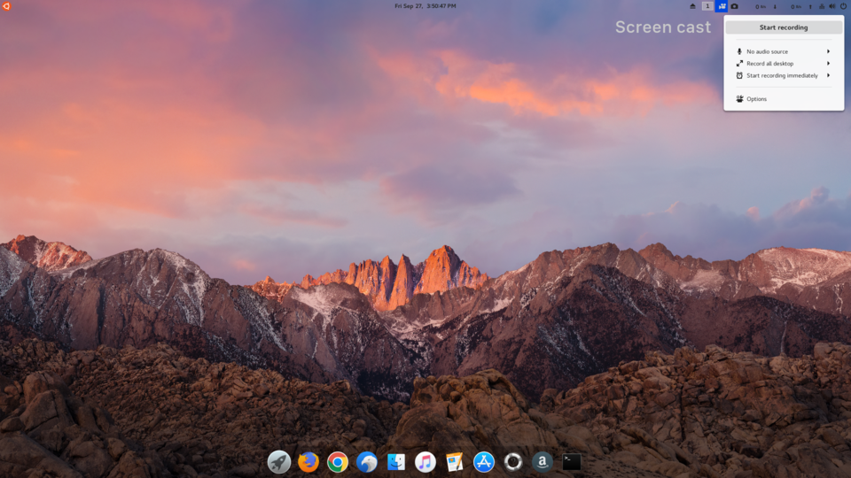

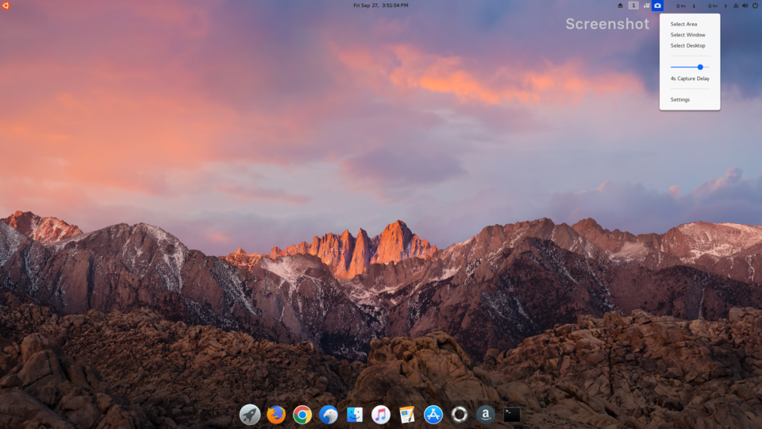

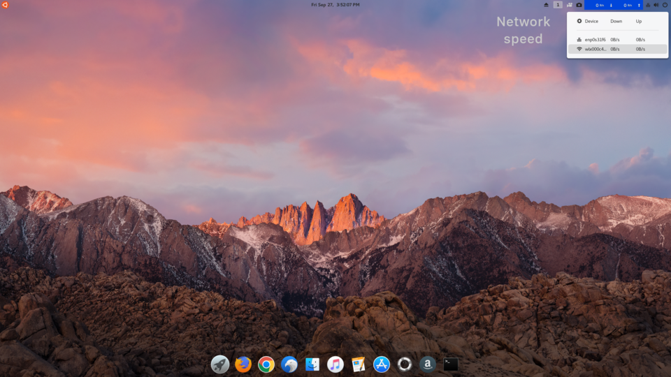

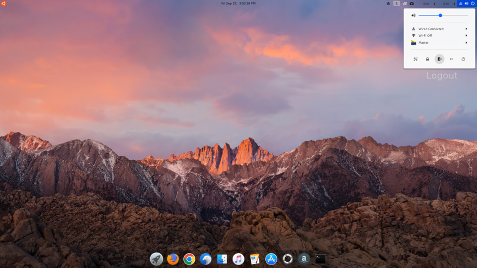

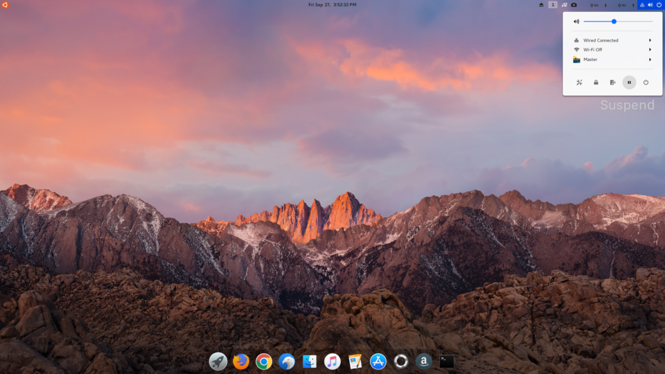

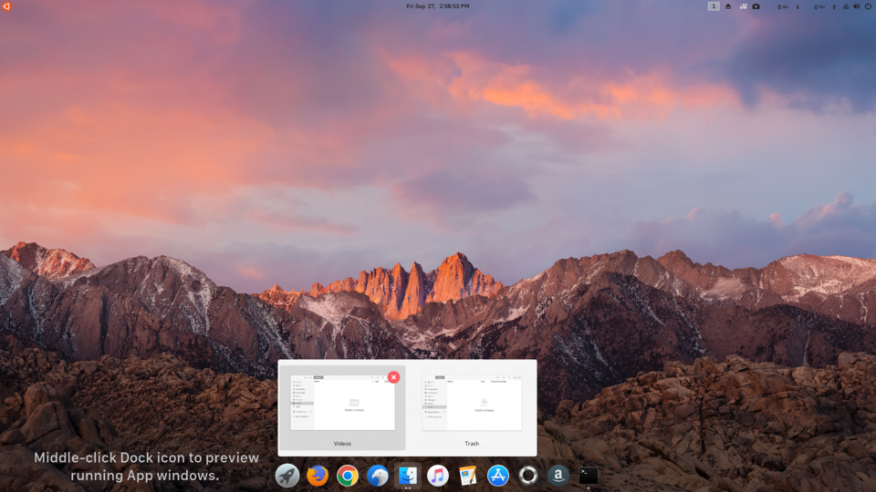

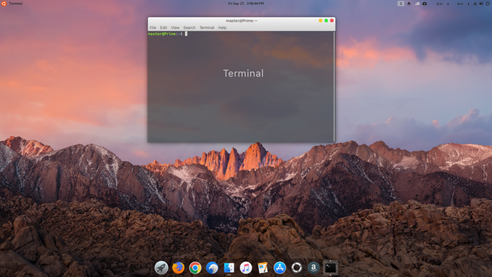

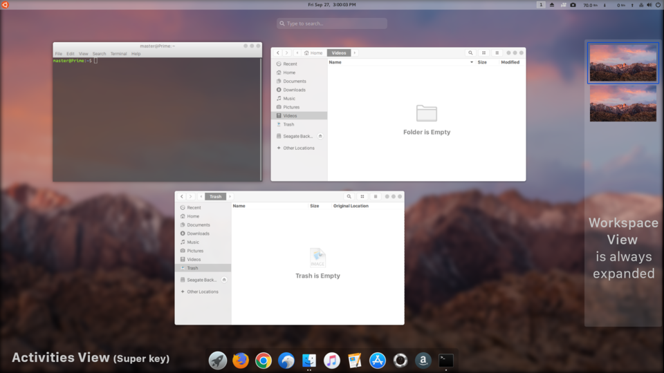

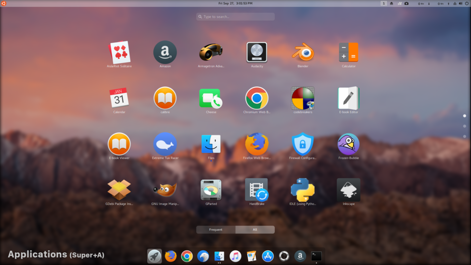

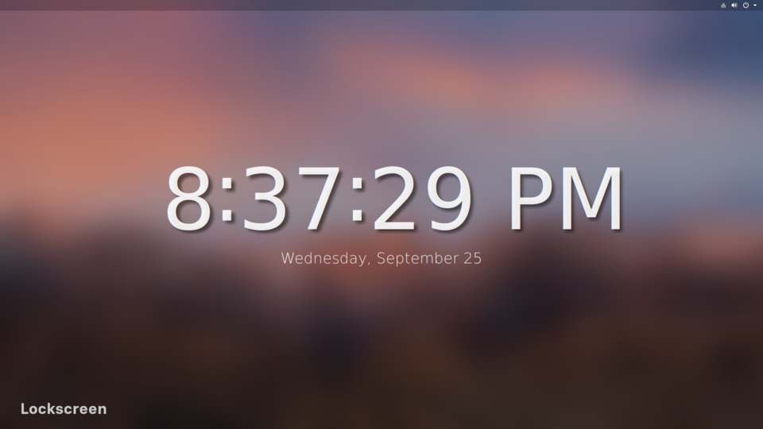

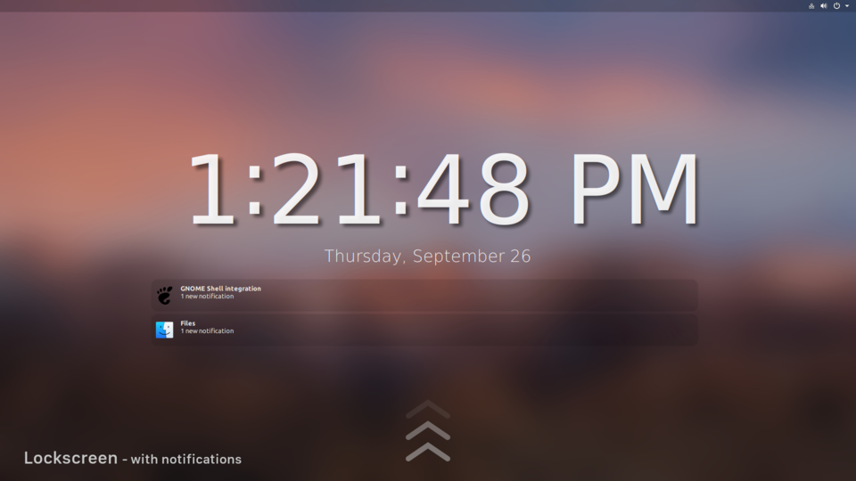

##### In the desktop environment, you can change the wallpaper of your desktop and screensaver anytime. Simply do these steps: 

1. Put your mouse pointer over image file and right click it.
2. Select "Scripts" --> left or right click on "Revamp Wallpaper"

<video src="video/RevampWallpaper_v2.webm"></video>
