# REVAMP1804

Giving Ubuntu 18.04 a Sierra-light-ish desktop look and feel.

## Motivation:

Improving the look and feel of a newly installed Ubuntu 18.04 system is definitely helpful. This "revamping" process is time consuming. Revamping multiple systems (or user accounts) is even more tedious. Furthermore, using Ubuntu 18.04 with it's default settings does have it's quirks.

This program attempts to automates this revamping process to consistently give Ubuntu 18.04 a nice Sierra-light-ish desktop look and feel, with less of the built-in Ubuntu 18.04 quirks. 

## Program Overview:

This program does the following:

1. Install certain 'deb' packages (and ppa) into Ubuntu 18.04.
2. Install and enable themes and extensions:
   - Themes :  [McHigh Sierra](https://www.gnome-look.org/p/1013714/  ), [Cupertino iCons Collection](https://www.gnome-look.org/p/1102582/) , [MacOS MOD](https://www.gnome-look.org/p/1241071/), [SanFranciscoFont](https://github.com/AppleDesignResources/SanFranciscoFont), [macfonts](https://www.noobslab.com/2018/08/macbuntu-1804-transformation-pack-ready.html), [Revamp1804](resources/gnome-shell_theme/Revamp1804/revamp1804.css) 
   - Extensions :  [Always Zoom Workspaces](https://extensions.gnome.org/extension/503/always-zoom-workspaces/), [Arc Menu](https://extensions.gnome.org/extension/1228/arc-menu/), [Blyr](https://extensions.gnome.org/extension/1251/blyr/), [Dash to Dock](https://extensions.gnome.org/extension/307/dash-to-dock/), [Dynamic Panel Transparency](https://extensions.gnome.org/extension/1011/dynamic-panel-transparency/), [EasyScreenCast](https://extensions.gnome.org/extension/690/easyscreencast/), [Log Out Button](https://extensions.gnome.org/extension/1143/logout-button/), [NetSpeed](https://extensions.gnome.org/extension/104/netspeed/), [Removable Drive Menu](https://extensions.gnome.org/extension/7/removable-drive-menu/), [Screenshot Tool](https://extensions.gnome.org/extension/1112/screenshot-tool/), [Suspend Button](https://extensions.gnome.org/extension/826/suspend-button/), [User Themes](https://extensions.gnome.org/extension/19/user-themes/), [Workspace Indicator](https://extensions.gnome.org/extension/21/workspace-indicator/)
3. Customize the settings of these applications, extensions and more.
4. Install a nautilus script to allow an easy change of the desktop and screensaver wallpapers.  

## Prerequisites

- An installed Ubuntu 18.04 system with Internet access.
- Administrator Privilege
- Python 3.6

## How to Use?

First,  clone this repository:

  `$ git clone https://github.com/sunbearc22/Revamp1804.git <your local directory>`

Next, change to your local Revamp1804 directory and issue the below command(s).

- **To revamp Ubuntu 18.04** :

  `$ python3.6 revamp1804.py --install`

- **To undo ( i.e. revert back to a fresh Ubuntu 18.04 look and feel ) **:

​      `$ python3.6 revamp1804.py --remove`

## Acknowledgements

- revamp1804.css is adapted from [High Ubunterra](https://www.gnome-look.org/p/1207015/ ) and ubuntu.css. 
- I like to thank the developers of [McHigh Sierra](https://www.gnome-look.org/p/1013714/  ), [Cupertino iCons Collection](https://www.gnome-look.org/p/1102582/) , [MacOS MOD](https://www.gnome-look.org/p/1241071/), [SanFranciscoFont](https://codeload.github.com/AppleDesignResources/SanFranciscoFont/zip/master), [macfonts](http://drive.noobslab.com/data/Mac/macfonts.zip),  [Always Zoom Workspaces](https://extensions.gnome.org/extension/503/always-zoom-workspaces/), [Arc Menu](https://extensions.gnome.org/extension/1228/arc-menu/), [Blyr](https://extensions.gnome.org/extension/1251/blyr/), [Dash to Dock](https://extensions.gnome.org/extension/307/dash-to-dock/), [Dynamic Panel Transparency](https://extensions.gnome.org/extension/1011/dynamic-panel-transparency/), [EasyScreenCast](https://extensions.gnome.org/extension/690/easyscreencast/), [Log Out Button](https://extensions.gnome.org/extension/1143/logout-button/), [NetSpeed](https://extensions.gnome.org/extension/104/netspeed/), [Removable Drive Menu](https://extensions.gnome.org/extension/7/removable-drive-menu/), [Screenshot Tool](https://extensions.gnome.org/extension/1112/screenshot-tool/), [Suspend Button](https://extensions.gnome.org/extension/826/suspend-button/), [User Themes](https://extensions.gnome.org/extension/19/user-themes/), and [Workspace Indicator](https://extensions.gnome.org/extension/21/workspace-indicator/) for their beautiful work-of-art.
- I like to thank [PRATAP](https://askubuntu.com/users/739431/pratap), [pomsky](https://askubuntu.com/users/480481/pomsky), [vanadium](https://askubuntu.com/users/558158/vanadium), [jos](https://askubuntu.com/users/149708/jos), [rinzwind](https://askubuntu.com/users/15811/rinzwind), [dk-bose](https://askubuntu.com/users/248158/dk-bose) and [heynnema](https://askubuntu.com/users/4272/heynnema) for their answers and comments to my AskUbuntu questions. 

## The Revamp1804 Desktop

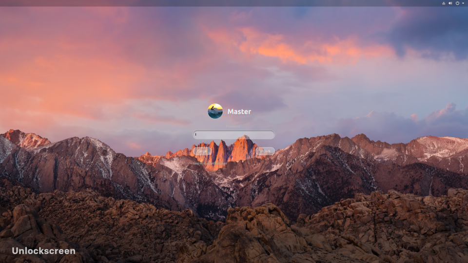

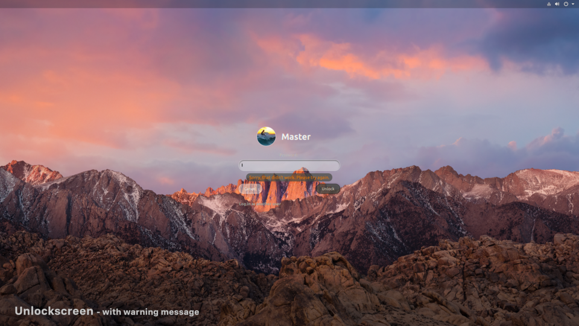

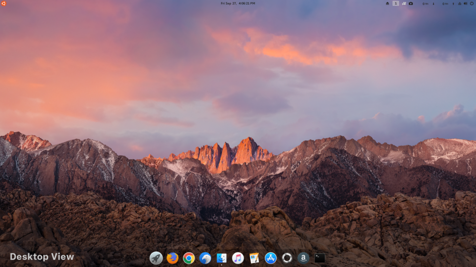

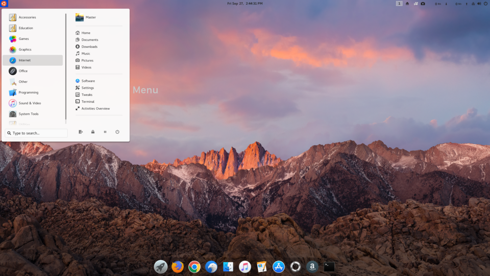

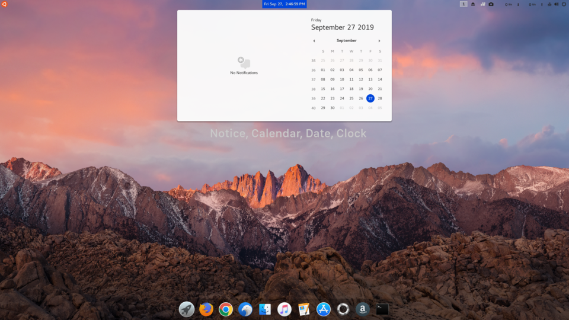

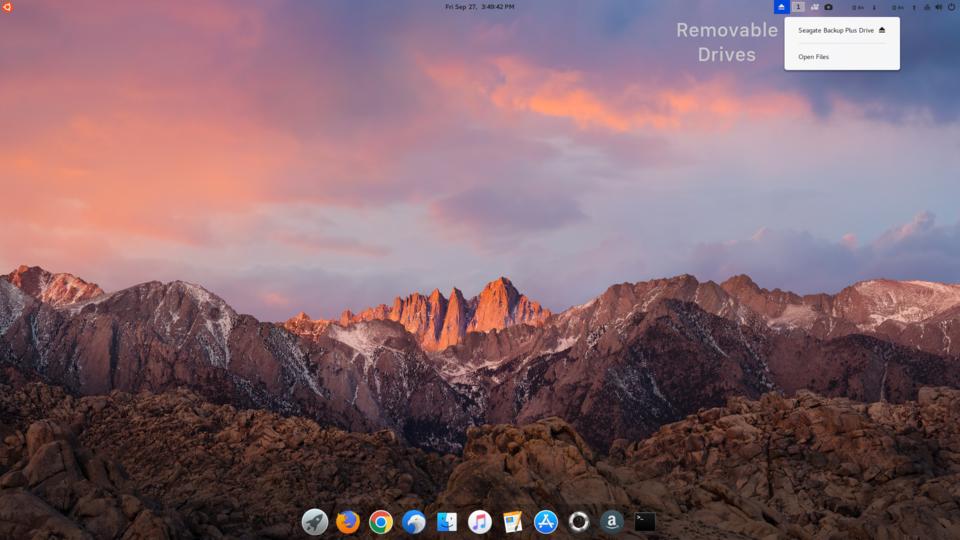

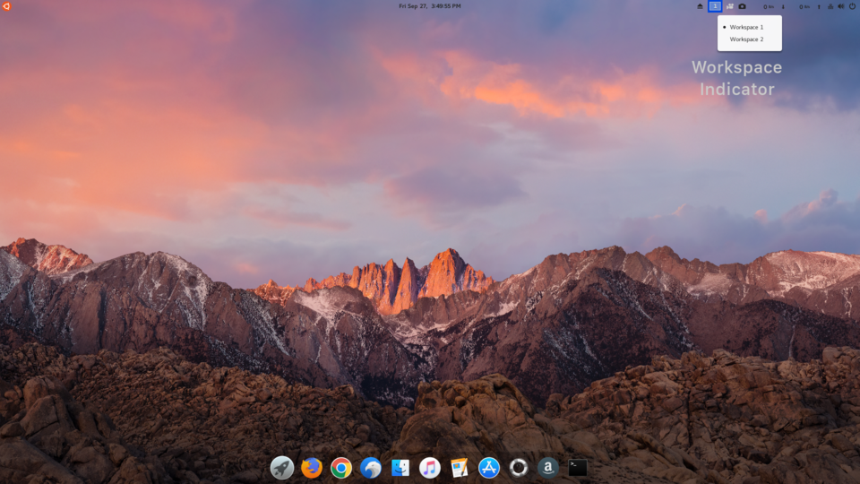

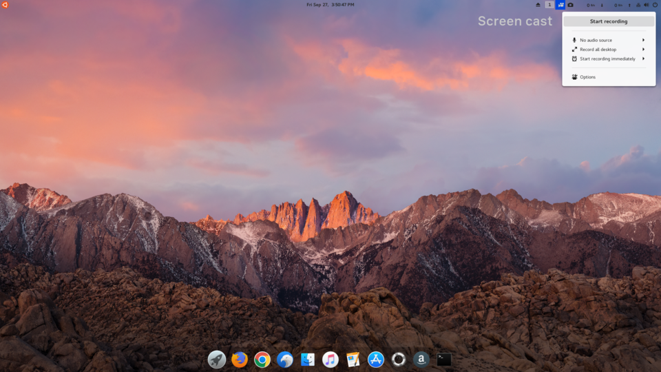

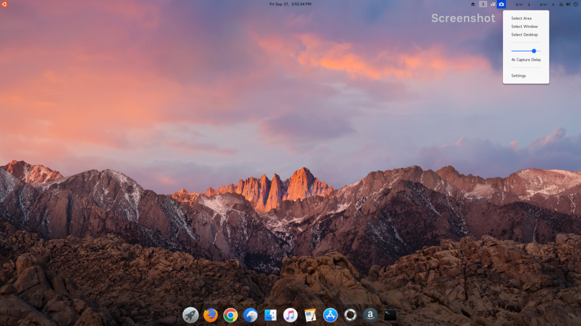

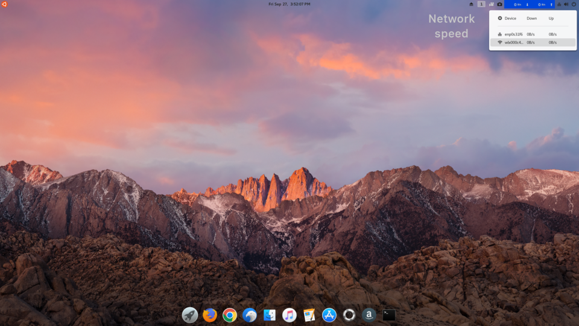

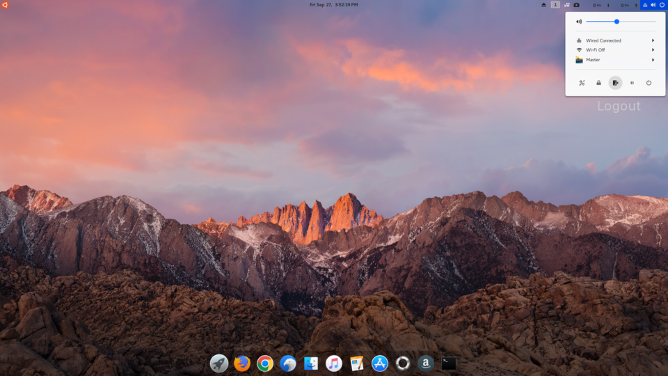

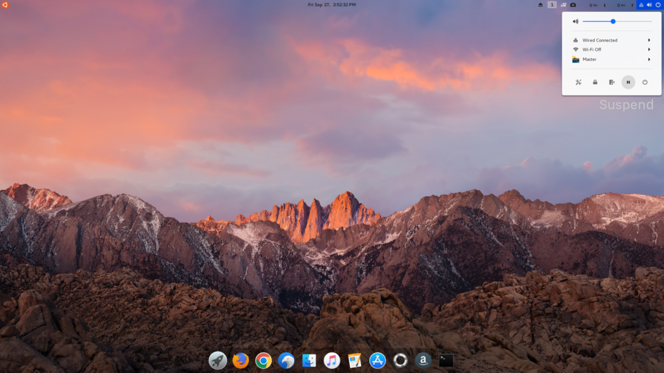

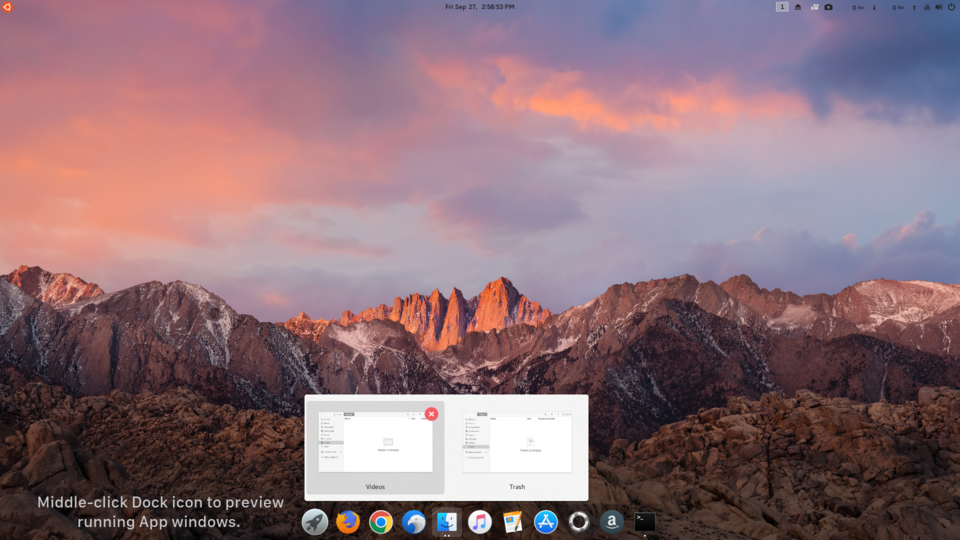

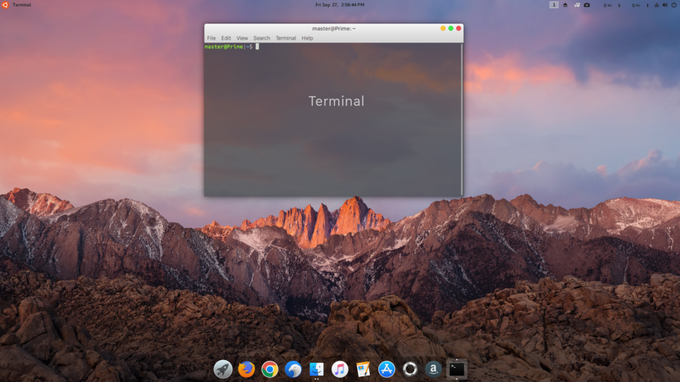

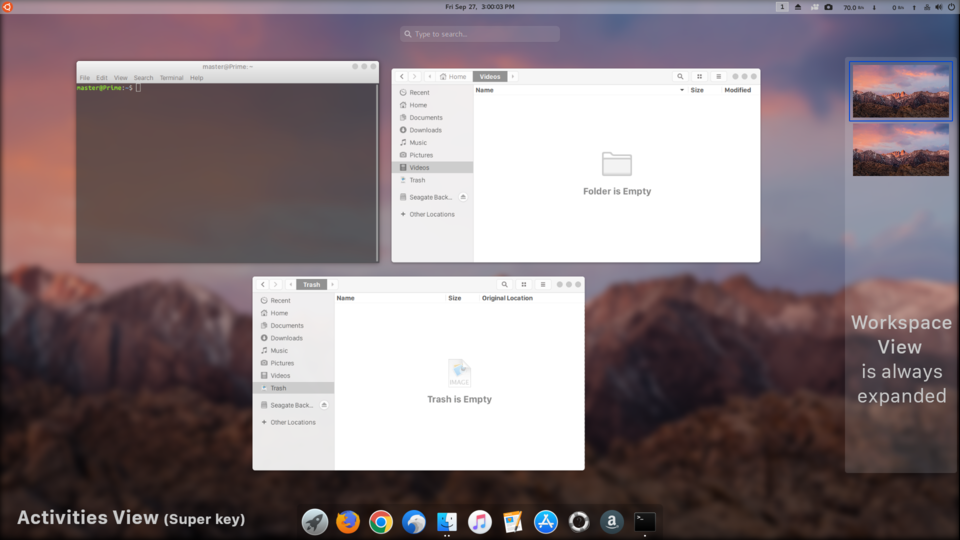

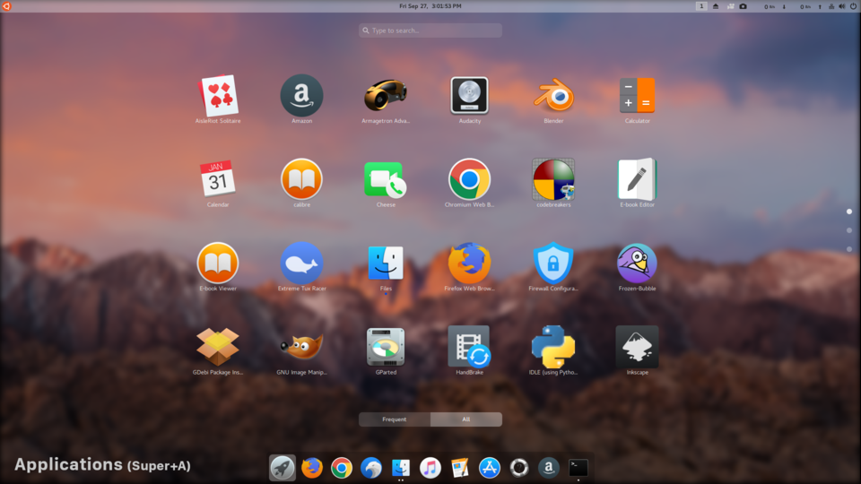

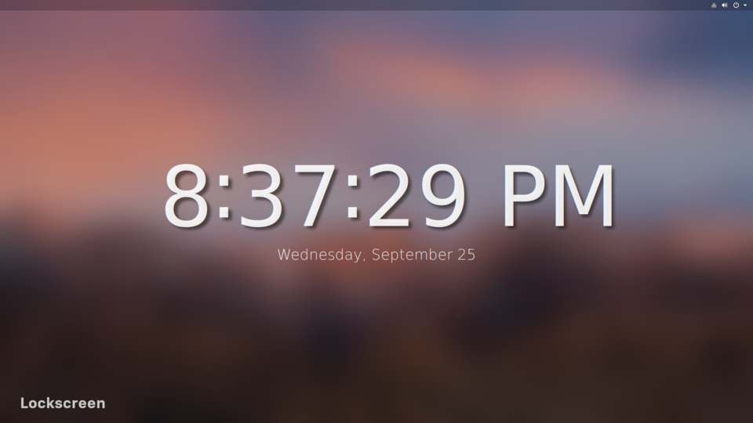

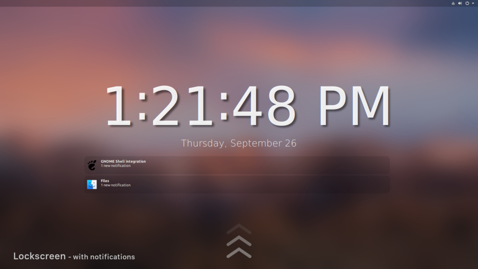

##### In the desktop environment, you can change the wallpaper of your desktop and screensaver anytime. Simply do these steps: 

1. Put your mouse pointer over image file and right click it.

2. Select "Scripts" --> left or right click on "Revamp Wallpaper"

   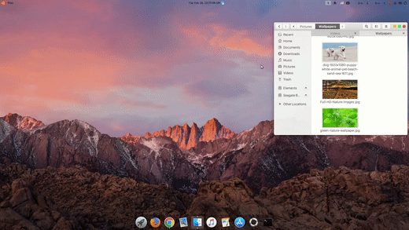

